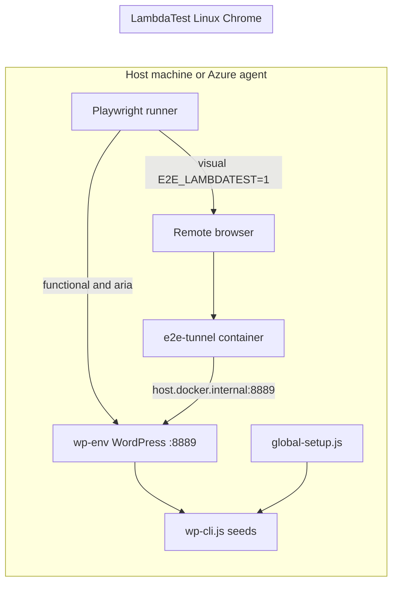

# Agent guide: `tests/` (Playwright e2e)

**Audience:** Cursor and other coding agents maintaining or extending this theme’s automated tests.

**Human-oriented runbook:** [`readme.md`](../readme.md) (install, npm scripts, LambdaTest tunnel). This file captures **why** the stack is shaped the way it is and **how to change it safely**.

---

All automated tests live under **`tests/e2e/**`**: Playwright + wp-env Docker WordPress + `@wordpress/scripts` / `@wordpress/e2e-test-utils-playwright`. PHP seed **fixtures** live under `tests/fixtures/` and run via `wp-env run cli wp eval-file`.

---

## High-level architecture

1. **WordPress** runs in **wp-env** (generated `.wp-env.e2e.json`) as a **subdirectory multisite** on port **8889**.
2. **Functional** and **`@aria`** tests use **host** Chrome locally (`channel: 'chrome'`) or Chromium in CI.
3. **`@visual`** tests use **LambdaTest** Linux Chrome (`E2E_LAMBDATEST=1`) for PNG baselines.
4. **Admin auth** for wp-scripts setup uses **127.0.0.1**; LambdaTest runs get a **second** storage state logged in via **host.docker.internal**.

---

## Directory layout (`tests/e2e`)

| Path | Role |
|------|------|
| `blocks/*.spec.js` | Block-focused specs (editor + frontend + snapshots) |
| `pages/*.spec.js` | Page integration specs (composed templates, section order, interactions) |
| `layout/*.spec.js` | Theme chrome (header/footer) |
| `fixtures/test.js` | Extends `@wordpress/e2e-test-utils-playwright` `test` / `expect` — **import from here** |
| `helpers/` | Shared flows (`editor.js`, `header.js`, `e2e-env.js`, `lambdatest.js`, `wp-cli.js`, `viewports.js`) |
| `scripts/` | wp-env boot (`start-wp-env-e2e.mjs`, `generate-wp-env-e2e.mjs`), plugin resolve (`resolve-plugin.mjs`), tunnel (`lambdatest-tunnel.mjs`) |
| `mu-plugins/e2e-seed-endpoint.php` | LambdaTest URL rewriting + block allowlist |
| `plugins.json` | Committed plugin catalog |
| `**/__snapshots__/` | PNG and YAML baselines next to specs |

Config: repo root [`playwright.config.js`](../playwright.config.js).

---

## Design decisions (preserve unless intentionally changing product/infra)

### Playwright CLI vs `wp-scripts test-playwright`

- **Use:** `playwright test` via `npm run test:e2e:*`.
- **Why:** `@wordpress/scripts` re-triggers `playwright install` on every invocation.

### wp-env port **8889** and subsite **`/e2e-dept/`**

- Chain: `tests/e2e/helpers/e2e-env.js` → `playwright.config.js` (default `WP_BASE_URL`) → `BC_SITKA_E2E_WP_PORT` in the mu-plugin.
- **Playwright `WP_BASE_URL` defaults to** `http://127.0.0.1:8889/e2e-dept` (Sitka department subsite). WP-CLI seeds use `--url` on the subsite unless seeding the main-site core CPTs.
- **Changing the port or subsite slug requires updating all of the above.**

### Multisite topology (e2e)

| Site | URL | Role |
|------|-----|------|
| Main (blog 1) | `http://127.0.0.1:8889` | Bellevue 2022 CPT plugins + [`seed-e2e-core-site.php`](../fixtures/seed-e2e-core-site.php) (organization, news, programs, etc.). Default theme only — **no** Bellevue 2022 theme. |
| Department subsite | `http://127.0.0.1:8889/e2e-dept` | Sitka theme + full e2e plugin stack + [`seed-e2e-integration.php`](../fixtures/seed-e2e-integration.php). |

CPT plugins from `bellevue-2022-theme-plugins` are **activated on both sites** (not network-activated), matching production.

After switching from single-site e2e to multisite, run `npm run env:e2e:stop` then `wp-env destroy --config=.wp-env.e2e.json` before the next `env:e2e:start`.

### webServer readiness

Playwright runs `start-wp-env-e2e.mjs` and waits for the log line `WP_ENV_E2E_READY_LOG` in [`e2e-env.js`](e2e/helpers/e2e-env.js) (`webServer.wait.stdout`). The start script also skips `wp-env start` when WordPress is already up. `reuseExistingServer: !CI` and `E2E_WPENV_EXTERNAL=1` attach to an already-running wp-env (Azure starts wp-env once per job).

### Host URL: **127.0.0.1**, not `localhost`

Avoids macOS IPv6/`::1` mismatches between Playwright and wp-env.

### LambdaTest base URL: **host.docker.internal**

- Remote browsers use `http://host.docker.internal:8889/e2e-dept` (`getLambdaTestPlaygroundBaseUrl()`).
- Host-side WP-CLI and wp-scripts login stay on **127.0.0.1**.
- Mu-plugin rewrites asset URLs when `HTTP_HOST` is `host.docker.internal`.

### Block registration allowlist

The mu-plugin unregisters every `bc-sitka-spruce/*` block **not** listed in `BC_SITKA_E2E_ALLOWED_THEME_BLOCKS` ([`e2e-seed-endpoint.php`](e2e/mu-plugins/e2e-seed-endpoint.php)). The list covers blocks used by integration seeds and editor specs (homepages, flexible page, tabs, cards, etc.), not only block-focused specs. Loading every block’s `editorScript` through the tunnel slows LambdaTest editor screenshots. **Add the block name when seeds or a new spec need that block on the frontend or in the editor.**

### Bellevue 2022 / core-site blocks

These blocks read main-site CPTs via `switch_to_blog()` / `network_site_url()` REST. Frontend coverage lives in `pages/*.spec.js` after [`seed-e2e-core-site.php`](../fixtures/seed-e2e-core-site.php) + [`e2e-core-content-helpers.php`](../fixtures/e2e-core-content-helpers.php). [`tests/e2e/blocks/CoreSiteBlocks.spec.js`](e2e/blocks/CoreSiteBlocks.spec.js) still covers editor insert/load.

### Page integration seeds

- [`tests/fixtures/seed-e2e-core-site.php`](../fixtures/seed-e2e-core-site.php) — main-site CPTs (`seedCoreSiteData()` / wp-env `afterStart`).
- [`tests/fixtures/seed-e2e-integration.php`](../fixtures/seed-e2e-integration.php) — subsite pages/CPTs for `pages/*.spec.js` (via `seedIntegrationData()` in `wp-cli.js`, which ensures core seed first).
- [`tests/fixtures/e2e-homepage-variant.php`](../fixtures/e2e-homepage-variant.php) — sets `site_type` and static front page per homepage spec.
- [`tests/fixtures/seed-chrome-variants.php`](../fixtures/seed-chrome-variants.php) — ACF chrome states for extended header/footer tests.

### Seeding: WP-CLI via wp-env

- `tests/e2e/helpers/wp-cli.js` runs `wp-env run --config=.wp-env.e2e.json cli wp eval-file …`.
- Seed helpers cache results per process; do not seed in `beforeEach`.

### Plugin resolution

- **Catalog:** `tests/e2e/plugins.json` — remote URLs, `envPathVar`, `plugins.local.json` overlay.
- **Generated config:** `npm run env:e2e:generate` writes `.wp-env.e2e.json` (gitignored).

### Workers = **1**

One WordPress database; parallel workers race on posts and editor state.

### Viewport projects and `@visual` budget

- `desktop` / `tablet` / `mobile` projects for all runs.
- `skipDuplicateBlockViewport` limits block-editor and `@aria` to **desktop**; screenshots, frontend layout, axe, and header/footer still run all viewports.
- **`@visual` is only for tests that call `toHaveScreenshot`.** Attribute or DOM assertions belong in functional tests (host), not LambdaTest.

### Test tags

| Tag | Runner | Snapshots |
|-----|--------|-----------|
| (none) | Functional on host | — |
| `@aria` | Host | `*.yml` (`toMatchAriaSnapshot`) |
| `@visual` | LambdaTest | `*.png` (`toHaveScreenshot`) |

### LambdaTest tunnel

- Container **e2e-tunnel**; auto-start in `global-setup.js` unless `E2E_LAMBDATEST_TUNNEL_AUTO=0`.
- CI starts the tunnel with `npm run tunnel:e2e:start` and sets `E2E_LAMBDATEST_TUNNEL_AUTO=0` for the visual run.

### Visual testing pipeline (LambdaTest)

| Layer | File | Role |
|--------|------|------|
| Docker tunnel `e2e-tunnel` | [`lambdatest.js`](e2e/helpers/lambdatest.js), [`lambdatest-tunnel.mjs`](e2e/scripts/lambdatest-tunnel.mjs) | Remote browsers reach host wp-env via `host.docker.internal:8889` |
| Playwright `connect` | `playwright.config.js` when `E2E_LAMBDATEST=1` | Linux Chrome on LambdaTest |
| Request proxy | [`lambdatest-tunnel-proxy.js`](e2e/helpers/lambdatest-tunnel-proxy.js) | Routes remote requests to loopback wp-env when the tunnel path is flaky |
| URL rewrite + allowlist | [`e2e-seed-endpoint.php`](e2e/mu-plugins/e2e-seed-endpoint.php) | `X-E2E-Public-Origin`, asset URLs, block allowlist |
| Admin cookies | [`global-setup.js`](e2e/global-setup.js) | Host login, then remap storage state for tunnel host |
| Navigation | [`e2e-navigation.js`](e2e/helpers/e2e-navigation.js) | Rewrite seed permalinks for visual runs |

Committed **PNG** baselines must be produced on LambdaTest (`npm run test:e2e:update-snapshots`).

### Editor preferences seed

`seed-editor-preferences.php` runs in wp-env `afterStart` only (not in Playwright global setup).

---

## Environment variables (quick reference)

| Variable | Typical value | Meaning |
|----------|----------------|---------|
| `WP_BASE_URL` | `http://127.0.0.1:8889/e2e-dept/` | Override Playwright default (department subsite) |
| `E2E_WPENV_EXTERNAL` | `1` | Skip Playwright `webServer`; use existing wp-env |
| `E2E_LAMBDATEST` | `1` | LambdaTest browser + tunnel base URL |
| `E2E_LAMBDATEST_TUNNEL_AUTO` | `0` / unset | `0` = do not auto-start tunnel |
| `E2E_LAMBDATEST_PLAYGROUND_URL` | optional | Default `http://host.docker.internal:8889/e2e-dept` |
| `LT_USERNAME`, `LT_ACCESS_KEY` | secrets | Required for `@visual` |
| `GITHUB_PAT`, `ACF_DOWNLOAD_URL` | CI / local | Plugin downloads |

---

## CI (Azure DevOps — `azure-pipelines.yml` Test stage)

E2e runs in the shared **theme-ci** **Test** stage (`runTests: true`). **DeployTest_*** Kinsta stages wait for Test to pass.

**One-time ADO setup:** Create Library variable group **`sitka-e2e`** with `LT_USERNAME`, `LT_ACCESS_KEY`, `GITHUB_PAT`, `ACF_DOWNLOAD_URL`, and authorize it for the `bc-sitka-spruce-department-theme` CI pipeline.

**Test job flow** (see [`.azuredevops/e2e-test-steps.yml`](../.azuredevops/e2e-test-steps.yml)):

1. `build-base` + `npm run build` + `replacetokens` on `style.css` (Test job rebuilds the theme because wp-env needs a full checkout and `node_modules`, not the pruned Build artifact zip).
2. Playwright Chromium, `env:e2e:start` once.
3. `test:e2e:functional:external`.
4. `tunnel:e2e:start` + `test:e2e:visual` with `E2E_WPENV_EXTERNAL=1` and `E2E_LAMBDATEST_TUNNEL_AUTO=0`.
5. Stop tunnel and `env:e2e:stop` (always); publish JUnit from `artifacts/test-results/*.xml`.

**Re-run e2e only:** Queue the CI pipeline manually and run the **Test** stage only.

**Job timeout:** Hosted agents default to 60 minutes for the Test job; watch duration on first full PR run.

---

## Code standards for this repo

Follow workspace **human-readable code** rules. Match neighboring files before adding abstractions.

---

## Agent hygiene

- **Do not** widen block allowlist beyond blocks under active test.
- **Do not** commit `plugins.local.json`, `.wp-env.e2e.json`, or secrets.
- **Do not** tag non-screenshot tests with `@visual`.
- Prefer **one fix in a shared helper** over duplicating URL/tunnel logic in each spec.

---

## File index (frequently touched)

| Concern | File |
|---------|------|
| Playwright projects, webServer, LambdaTest `use` | `playwright.config.js` |
| Tunnel + WS endpoint | `tests/e2e/helpers/lambdatest.js` |
| Port / host URL | `tests/e2e/helpers/e2e-env.js` |
| Publish / editor flows | `tests/e2e/helpers/editor.js` |
| Seed WP-CLI | `tests/e2e/helpers/wp-cli.js` |
| wp-env generate + start | `tests/e2e/scripts/generate-wp-env-e2e.mjs`, `start-wp-env-e2e.mjs` |
| Plugin sources | `tests/e2e/scripts/resolve-plugin.mjs`, `plugins.json` |
| URL filters + blocks | `tests/e2e/mu-plugins/e2e-seed-endpoint.php` |
| npm scripts | `package.json` (`test:e2e:*`, `env:e2e:*`, `tunnel:e2e:*`) |
| ADO e2e steps | `.azuredevops/e2e-test-steps.yml`, root `azure-pipelines.yml` |
